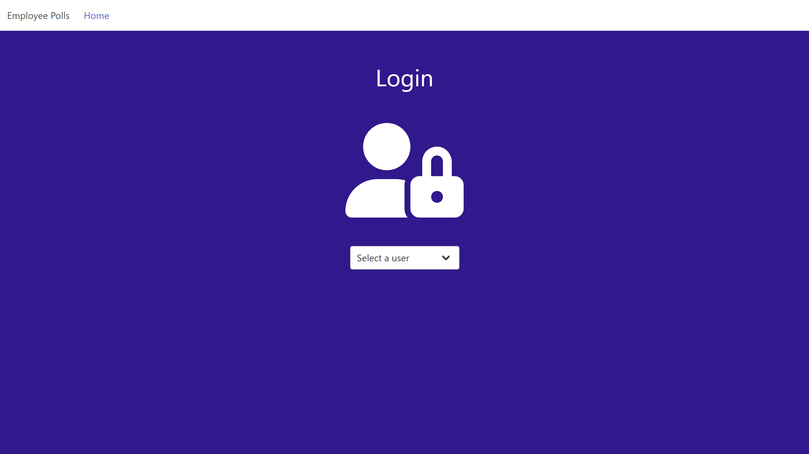
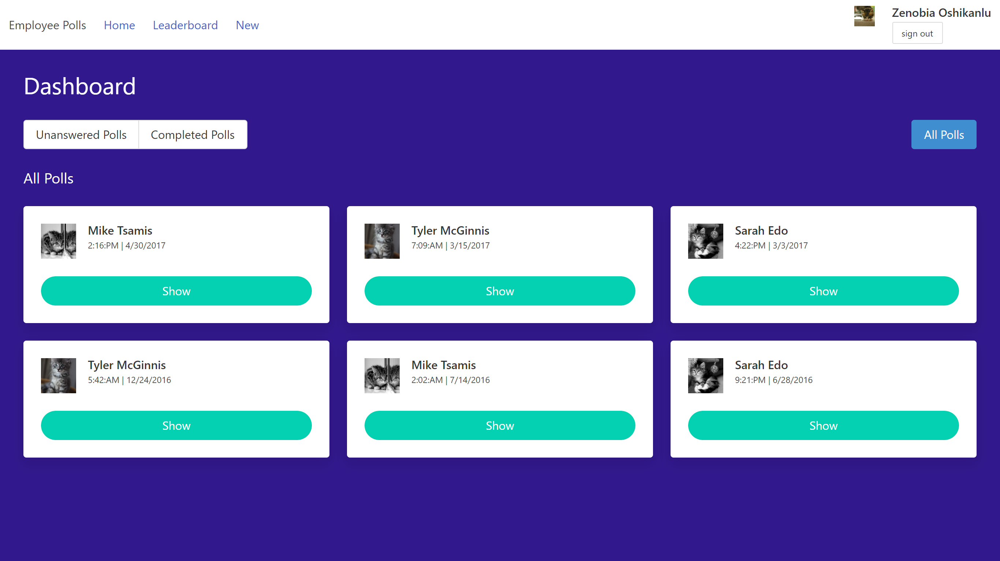
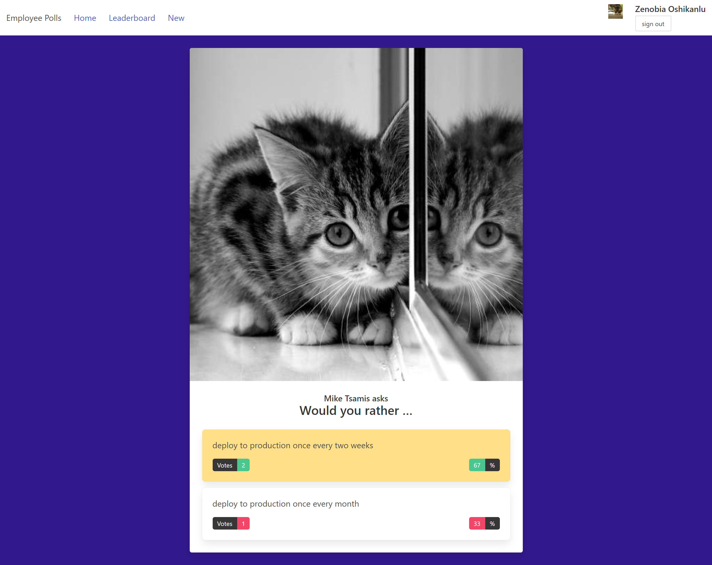
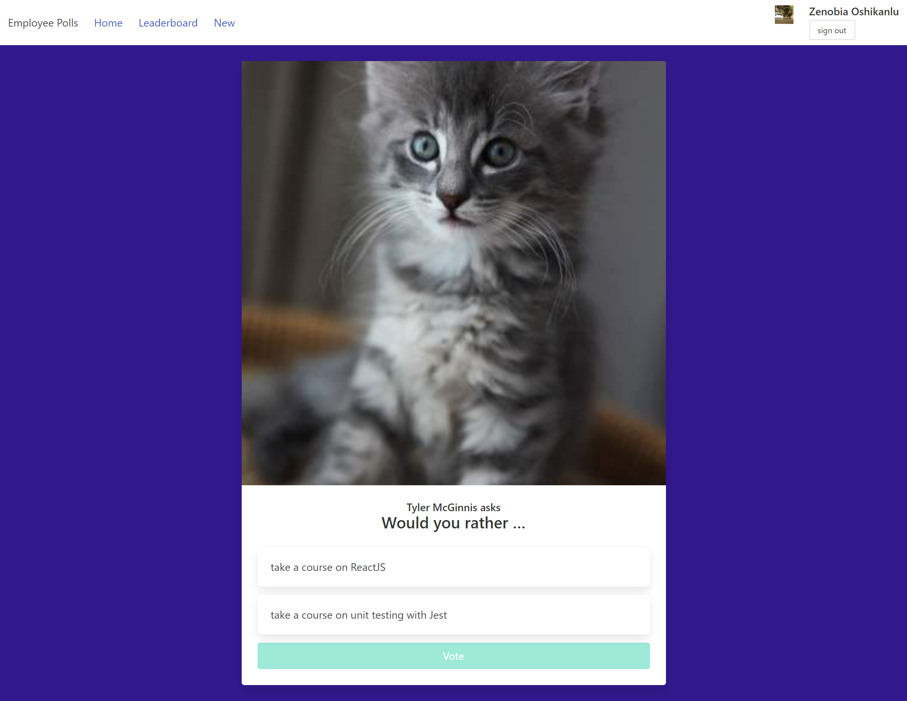
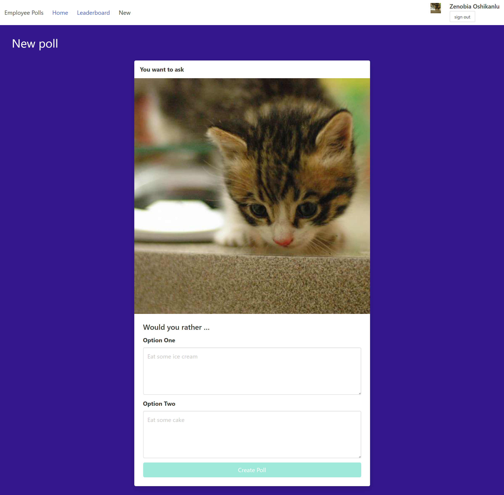
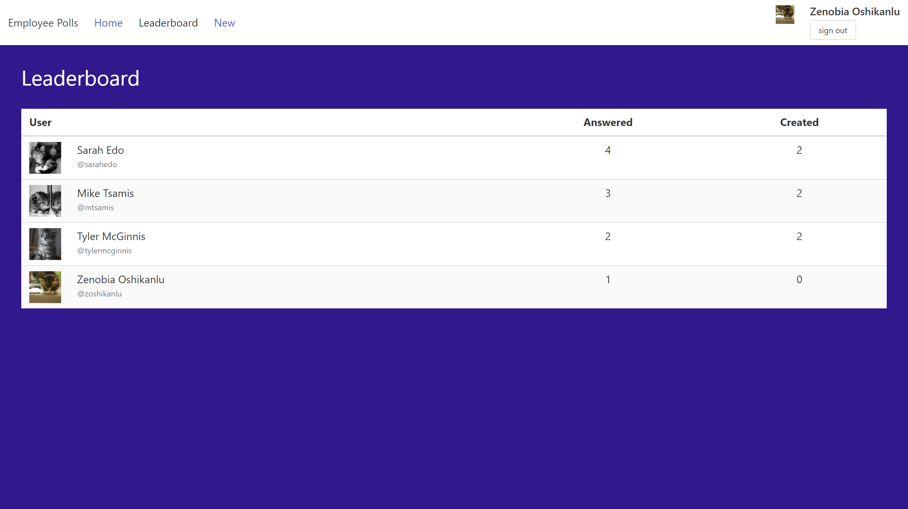

# Employee Polls

This small app allows users to create, answer, and track poll questions. Stats are shared through the leaderboard, using the number of polls answered and created as the main metrics.

## Getting Started

Please use `npm install` to download everything you will need. Once installed, use `npm start` to start the app. 

### Login 

Use the dropdown list to impersonate one of the "users". You must be an authoriazed user in order to use the app.

This project leverages the [Create React App](https://github.com/facebook/create-react-app) for developerment. In addition to React, this project uses the Redux state management engine, [FontAwesome](https://github.com/FortAwesome/Font-Awesome) icons, the [Bulma](https://github.com/jgthms/bulma) css framework, and [Sass](https://github.com/sass/sass) to bring them all together.

## Features

### Dashboard

View and sort poll questions currently available.

### Polls

View, answer, and create poll questions.

### Leaderboard

See employee scores sorted by polls answered and created.

## Available Scripts

In the project directory, you can run:

### `npm start`

Runs the app in the development mode.\
Open [http://localhost:3000](http://localhost:3000) to view it in your browser.

The page will reload when you make changes.\
You may also see any lint errors in the console.

### `npm test`

Launches the test runner in the interactive watch mode.\
See the section about [running tests](https://facebook.github.io/create-react-app/docs/running-tests) for more information.

### `npm run build`

Builds the app for production to the `build` folder.\
It correctly bundles React in production mode and optimizes the build for the best performance.

The build is minified and the filenames include the hashes.\
Your app is ready to be deployed!

See the section about [deployment](https://facebook.github.io/create-react-app/docs/deployment) for more information.

### `npm run eject`

**Note: this is a one-way operation. Once you `eject`, you can't go back!**

If you aren't satisfied with the build tool and configuration choices, you can `eject` at any time. This command will remove the single build dependency from your project.

Instead, it will copy all the configuration files and the transitive dependencies (webpack, Babel, ESLint, etc) right into your project so you have full control over them. All of the commands except `eject` will still work, but they will point to the copied scripts so you can tweak them. At this point you're on your own.

You don't have to ever use `eject`. The curated feature set is suitable for small and middle deployments, and you shouldn't feel obligated to use this feature. However we understand that this tool wouldn't be useful if you couldn't customize it when you are ready for it.

## License

employee-polls is Copyright © 2022 Julian Calzada. It is free software, and may be redistributed under the terms specified in the [LICENSE](LICENSE) file.
